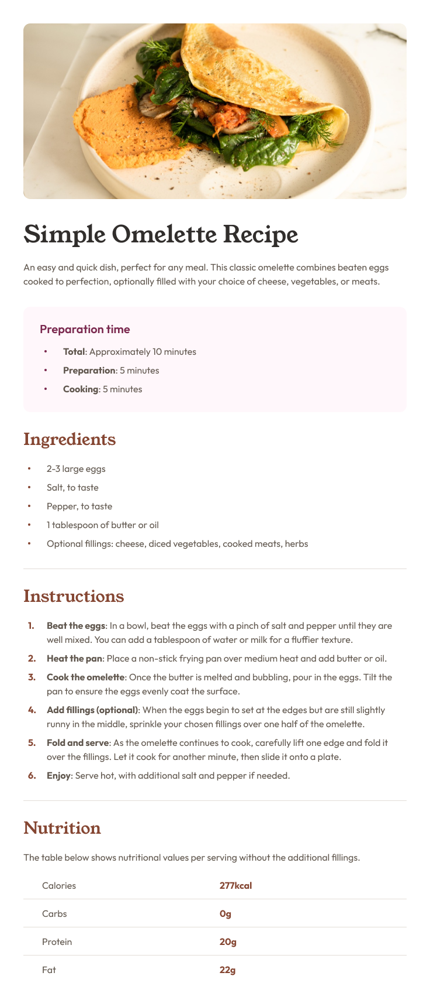

# Recipe page

This is a solution to the [Recipe page challenge on Frontend Mentor](https://www.frontendmentor.io/challenges/recipe-page-KiTsR8QQKm).

## Overview
  

### Links

- [Solution](https://github.com/aseptimu/Recipe-page)
- [Site](https://aseptimu.github.io/Recipe-page/)

## My process

### Built with

- Semantic HTML5 markup
- CSS custom properties
- Flexbox

## Author

- Github - [aseptimu](https://github.com/aseptimu)
- Frontend Mentor - [@aseptimu](https://www.frontendmentor.io/profile/aseptimu)
